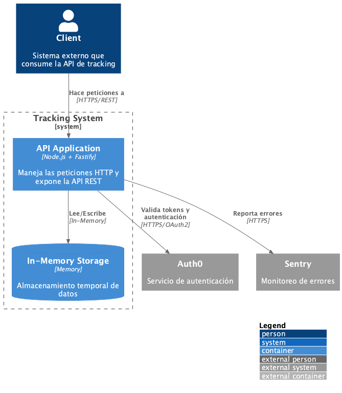
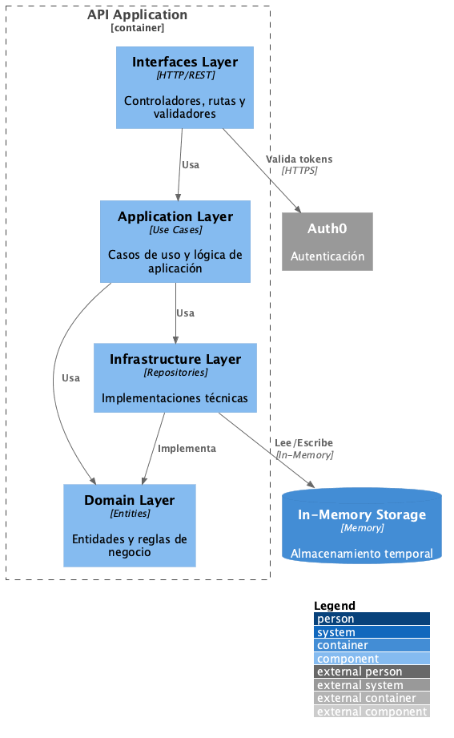

# 📐 Arquitectura del Sistema de Tracking API

Este documento describe la arquitectura del sistema utilizando el modelo C4, que proporciona una vista jerárquica desde el contexto general hasta los detalles de implementación.

## 🎯 Visión General

El sistema Tracking API es una solución diseñada para gestionar el seguimiento de unidades en tiempo real, proporcionando información precisa sobre su estado y ubicación a través de checkpoints.

## 📊 Diagramas de Arquitectura C4

### Nivel 1: Diagrama de Contexto


Este diagrama ilustra la interacción de alto nivel entre los diferentes actores del sistema:

- **Clientes Externos**: Sistemas y aplicaciones que consumen nuestra API
  - Aplicaciones móviles
  - Sistemas de gestión de flotas
  - Portales web de seguimiento
  
- **Tracking API**: Nuestro sistema principal
  - Gestiona la lógica de negocio del tracking
  - Procesa y almacena los checkpoints
  - Proporciona endpoints REST para consulta y actualización
  
- **Servicios Externos**:
  - **Auth0**: Autenticación y autorización
  - **Sentry**: Monitoreo y gestión de errores

### Nivel 2: Diagrama de Contenedores


Detalla los contenedores principales que componen el sistema:

- **API Application (Node.js + Fastify)**
  - Framework ligero y de alto rendimiento
  - Arquitectura modular y escalable
  - Implementación de API RESTful

- **In-Memory Storage**
  - Almacenamiento rápido y eficiente
  - Persistencia temporal de datos
  - Optimizado para operaciones frecuentes

- **External Services Integration**
  - Interfaces con servicios de terceros
  - Gestión de tokens y autenticación
  - Monitoreo y logging

### Nivel 3: Diagrama de Componentes


Visualiza la arquitectura interna siguiendo los principios de Clean Architecture:

1. **Capa de Interfaces**:
   - Controladores HTTP
   - Rutas y endpoints
   - Middlewares de validación
   - Transformación de datos (DTOs)

2. **Capa de Aplicación**:
   - Casos de uso del negocio
   - Orquestación de operaciones
   - Validaciones de reglas de negocio

3. **Capa de Dominio**:
   - Entidades core del negocio
   - Reglas y lógica de dominio
   - Interfaces de repositorios

4. **Capa de Infraestructura**:
   - Implementaciones de repositorios
   - Servicios externos
   - Configuraciones técnicas

### Nivel 4: Diagrama de Código


Organización del código en contextos delimitados:

- **Contexto de Tracking**:
  - Entidades: Unit, Checkpoint, CheckpointStatus
  - Casos de uso: GetTrackingHistory, ListUnitsByStatus, RegisterCheckpoint
  - Repositorios e implementaciones
  
- **Contexto Compartido**:
  - Manejo de errores del dominio
  - Servicios de autenticación
  - Utilidades comunes

## 🛠 Generación de Diagramas

Los diagramas se generan utilizando PlantUML. Sigue estos pasos:

```bash
# 1. Instalar PlantUML (macOS)
brew install plantuml

# 2. Verificar la instalación
plantuml -version

# 3. Generar los diagramas
plantuml docs/diagrams/*.puml

# 4. Verificar la generación
ls -l docs/diagrams/*.png
```

## 📚 Documentación Adicional

- [Clean Architecture](./README.md#arquitectura)
- [API Documentation](./README.md#api)
- [Development Setup](./README.md#desarrollo)