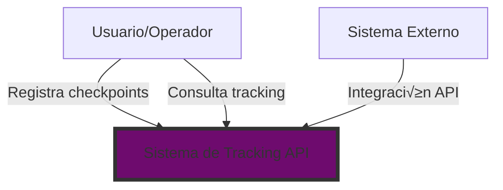
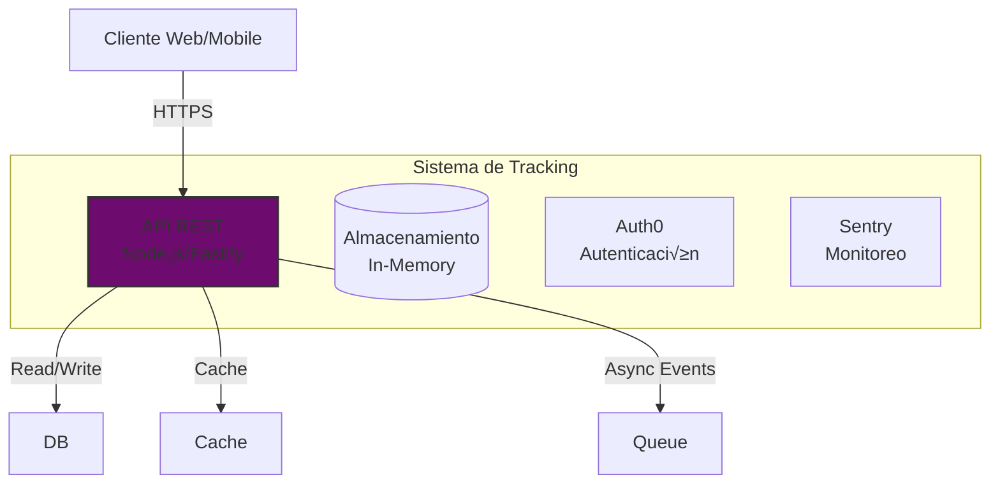
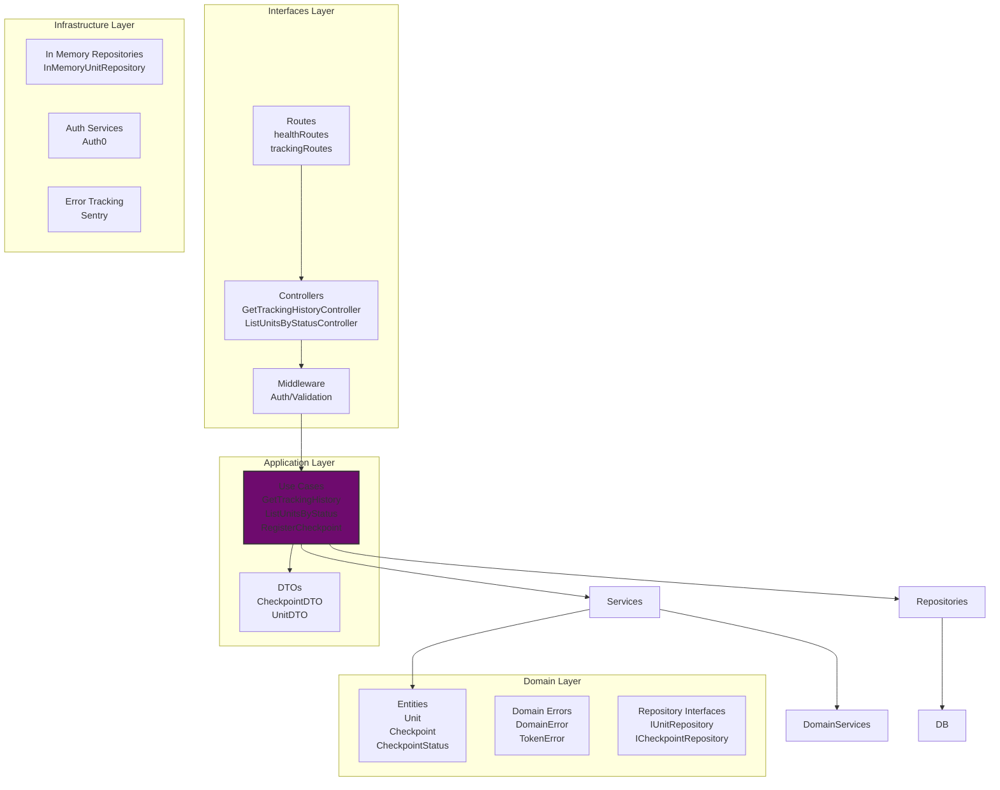
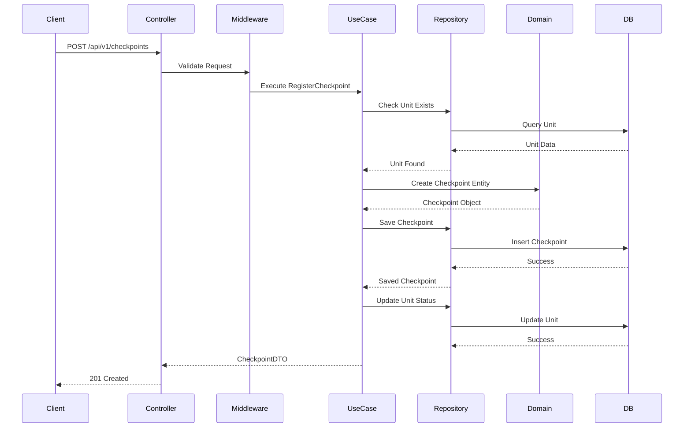

# üìê Arquitectura del Sistema de Tracking API

Este documento describe la arquitectura del sistema utilizando el modelo C4, que proporciona una vista jerárquica desde el contexto general hasta los detalles de implementación.

## 🎯 Visión General

El sistema Tracking API es una solución diseñada para gestionar el seguimiento de unidades en tiempo real, proporcionando información precisa sobre su estado y ubicación a través de checkpoints.

## üìä Diagramas de Arquitectura C4

### Nivel 1: Contexto del Sistema

```mermaid
graph TB
    User[Usuario/Operador]
    ExtSystem[Sistema Externo]
    TrackingAPI[Sistema de Tracking API]
    
    User -->|Registra checkpoints| TrackingAPI
    User -->|Consulta tracking| TrackingAPI
    ExtSystem -->|Integración API| TrackingAPI
    
    style TrackingAPI fill:#6E0B6E,stroke:#333,stroke-width:4px
```

### Nivel 2: Contenedores

```mermaid
graph TB
    subgraph "Sistema de Tracking"
        API[API REST<br/>Node.js/Fastify]
        Storage[(Almacenamiento<br/>In-Memory)]
        Auth[Auth0<br/>Autenticación]
        Sentry[Sentry<br/>Monitoreo]
    end
    
    Client[Cliente Web/Mobile]
    
    Client -->|HTTPS| API
    API -->|Read/Write| DB
    API -->|Cache| Cache
    API -->|Async Events| Queue
    
    style API fill:#6E0B6E,stroke:#333,stroke-width:2px
```

### Nivel 3: Componentes

```mermaid
graph TB
    subgraph "Interfaces Layer"
        Controllers[Controllers<br/>GetTrackingHistoryController<br/>ListUnitsByStatusController]
        Middleware[Middleware<br/>Auth/Validation]
        Routes[Routes<br/>healthRoutes<br/>trackingRoutes]
    end
    
    subgraph "Application Layer"
        UseCases[Use Cases<br/>GetTrackingHistory<br/>ListUnitsByStatus<br/>RegisterCheckpoint]
        DTOs[DTOs<br/>CheckpointDTO<br/>UnitDTO]
    end
    
    subgraph "Domain Layer"
        Entities[Entities<br/>Unit<br/>Checkpoint<br/>CheckpointStatus]
        Errors[Domain Errors<br/>DomainError<br/>TokenError]
        Repos[Repository Interfaces<br/>IUnitRepository<br/>ICheckpointRepository]
    end
    
    subgraph "Infrastructure Layer"
        InMemoryRepos[In Memory Repositories<br/>InMemoryUnitRepository]
        AuthService[Auth Services<br/>Auth0]
        ErrorTracking[Error Tracking<br/>Sentry]
    end
    
    Routes --> Controllers
    Controllers --> Middleware
    Middleware --> UseCases
    UseCases --> DTOs
    UseCases --> Services
    Services --> Entities
    Services --> DomainServices
    UseCases --> Repositories
    Repositories --> DB
    
    style UseCases fill:#6E0B6E,stroke:#333,stroke-width:2px
```

### Nivel 4: Código - Flujo de Registro de Checkpoint

```mermaid
sequenceDiagram
    participant Client
    participant Controller
    participant Middleware
    participant UseCase
    participant Repository
    participant Domain
    participant DB
    
    Client->>Controller: POST /api/v1/checkpoints
    Controller->>Middleware: Validate Request
    Middleware->>UseCase: Execute RegisterCheckpoint
    UseCase->>Repository: Check Unit Exists
    Repository->>DB: Query Unit
    DB-->>Repository: Unit Data
    Repository-->>UseCase: Unit Found
    UseCase->>Domain: Create Checkpoint Entity
    Domain-->>UseCase: Checkpoint Object
    UseCase->>Repository: Save Checkpoint
    Repository->>DB: Insert Checkpoint
    DB-->>Repository: Success
    Repository-->>UseCase: Saved Checkpoint
    UseCase->>Repository: Update Unit Status
    Repository->>DB: Update Unit
    DB-->>Repository: Success
    UseCase-->>Controller: CheckpointDTO
    Controller-->>Client: 201 Created
```

1. **Capa de Interfaces**:
   - Controladores HTTP
   - Rutas y endpoints
   - Middlewares de validación
   - Transformación de datos (DTOs)

2. **Capa de Aplicación**:
   - Casos de uso del negocio
   - Orquestación de operaciones
   - Validaciones de reglas de negocio

3. **Capa de Dominio**:
   - Entidades core del negocio
   - Reglas y lógica de dominio
   - Interfaces de repositorios

4. **Capa de Infraestructura**:
   - Implementaciones de repositorios
   - Servicios externos
   - Configuraciones técnicas

### Nivel 4: Diagrama de Código

Organización del código en contextos delimitados:

- **Contexto de Tracking**:
  - Entidades: Unit, Checkpoint, CheckpointStatus
  - Casos de uso: GetTrackingHistory, ListUnitsByStatus, RegisterCheckpoint
  - Repositorios e implementaciones
  
- **Contexto Compartido**:
  - Manejo de errores del dominio
  - Servicios de autenticación
  - Utilidades comunes

## � Decisiones Arquitectónicas (ADRs)

### ADR-001: Clean Architecture

**Estado:** Aceptado  
**Fecha:** 2024  
**Contexto:** Necesitamos una arquitectura que permita escalabilidad, mantenibilidad y testabilidad.  
**Decisión:** Implementar Clean Architecture con separación clara de capas.  
**Consecuencias:**
- ‚úÖ Alta mantenibilidad y testabilidad
- ‚úÖ Independencia de frameworks
- ‚úÖ Facilita cambios futuros
- ⚠️ Mayor complejidad inicial
- ⚠️ Más código boilerplate

### ADR-002: Fastify como Framework HTTP

**Estado:** Aceptado  
**Fecha:** 2024  
**Contexto:** Necesitamos alto rendimiento para manejar 1.2M checkpoints/día.  
**Decisión:** Usar Fastify en lugar de Express.  
**Consecuencias:**
- ‚úÖ 2x m√°s r√°pido que Express
- ✅ Validación de esquemas JSON incorporada
- ‚úÖ Mejor soporte para TypeScript
- ⚠️ Ecosistema más pequeño que Express

[Ver más ADRs en la documentación completa]

## üöÄ Escalabilidad y Performance

### Estrategia de Escalamiento

#### Escalamiento Horizontal
- **Load Balancer:** HAProxy/Nginx para distribuir carga
- **Instancias:** Mínimo 3 replicas en producción
- **Auto-scaling:** Basado en CPU/Memoria y requests/segundo

#### Optimizaciones de Performance
1. **Caching Strategy:**
   - Redis para tracking queries frecuentes
   - TTL de 5 minutos para consultas de tracking
   - Cache invalidation on checkpoint creation

2. **Database Optimization:**
   - Índices en: unitId, trackingId, status, timestamp
   - Particionamiento por fecha (mensual)
   - Read replicas para consultas

### Métricas de Performance Objetivo

| Métrica | Objetivo | Crítico |
|---------|----------|----------|
| Latencia P50 | < 50ms | < 100ms |
| Latencia P99 | < 200ms | < 500ms |
| Throughput | 15,000 req/s | 10,000 req/s |
| Disponibilidad | 99.9% | 99.5% |
| Error Rate | < 0.1% | < 1% |

## üîí Seguridad

### Medidas Implementadas
1. **Autenticación:** 
   - Auth0 para gestión de tokens
   - JWT para autenticación de requests
   - Variables de entorno seguras

2. **Validación y Protección:**
   - Validación de schemas JSON
   - Rate limiting configurable
   - CORS configurado por ambiente
   - Headers seguros con Helmet

3. **Configuración:**
   - Variables de entorno para credenciales
   - Diferentes configs por ambiente
   - Logs sensibles sanitizados

## üìä Monitoreo y Observabilidad

### Stack de Monitoreo
- **Error Tracking:** Sentry para monitoreo de errores
- **Logs:** Pino para logging estructurado
- **Health Check:** Endpoint `/health` para monitoreo
- **Deployment:** Monitoreo en Render
- **Tests:** Cobertura > 90% con Jest

## 📚 Documentación Adicional

- [Clean Architecture](./README.md#arquitectura)
- [API Documentation](./README.md#api)
- [Development Setup](./README.md#desarrollo)